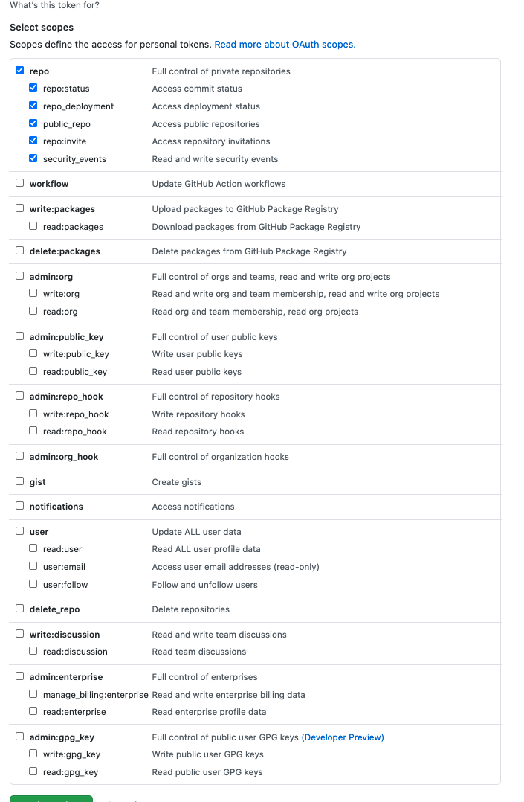

# Larryville

## A quick way to create a new Laravel project, initialize a git repo locally, and push it to Github

### Eventually this might be an awesome Laravel configuration system, maybe.

If you plan on using it, you'll need:

- A Bash-like shell, if you don't have this already, you probably need to install [WSL](https://docs.microsoft.com/en-us/windows/wsl/install-win10)
- [Git](https://git-scm.com/book/en/v2/Getting-Started-Installing-Git)
- A [GitHub](https://github.com/) account
- A [personal access token](https://github.com/settings/tokens) with access to create repos.
- [httpie](https://httpie.io)
- [composer](https://getcomposer.org/)  
- [laravel/installer](https://packagist.org/packages/laravel/installer) 

Your Personal Access Token should (for your own safety) be configured thusly: 

This is here for my pleasure, not yours.

No license granted. 

Source visible, &copy; all other rights reserved, 2021 by Jeremy Jacob Anderson

